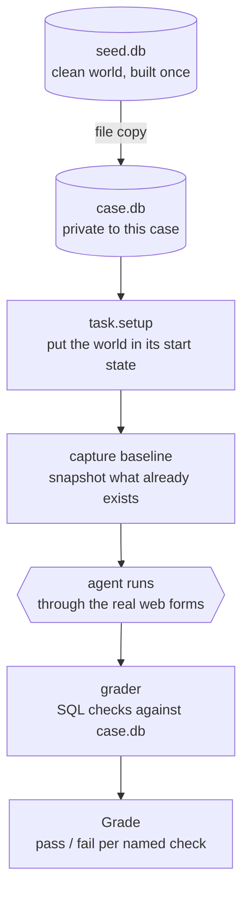
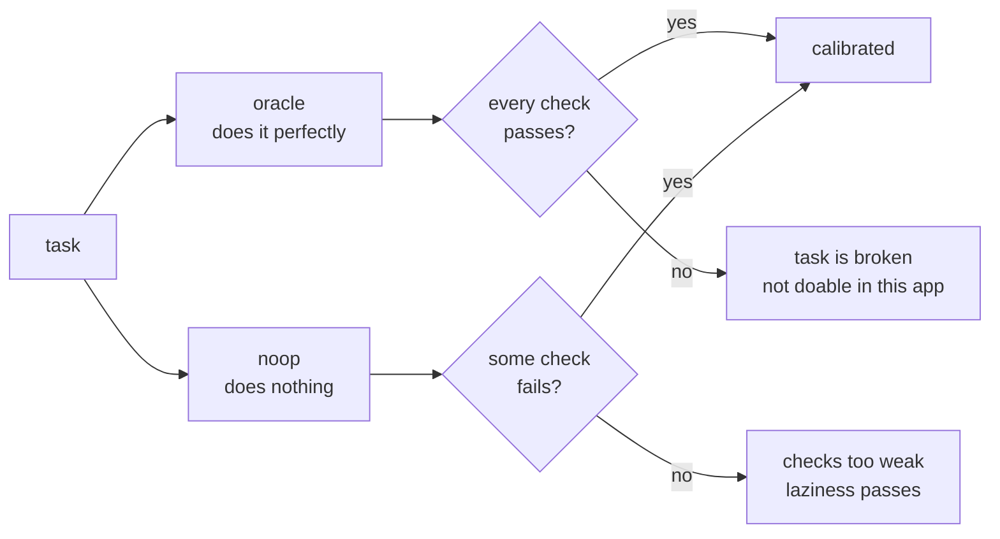
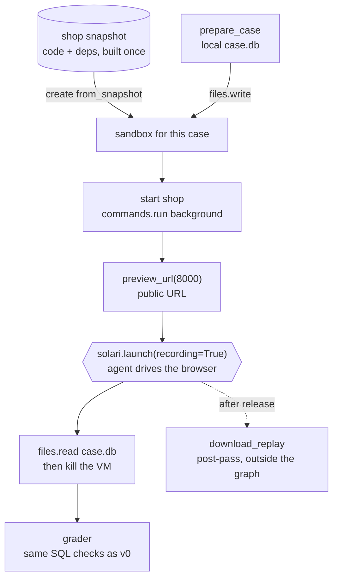
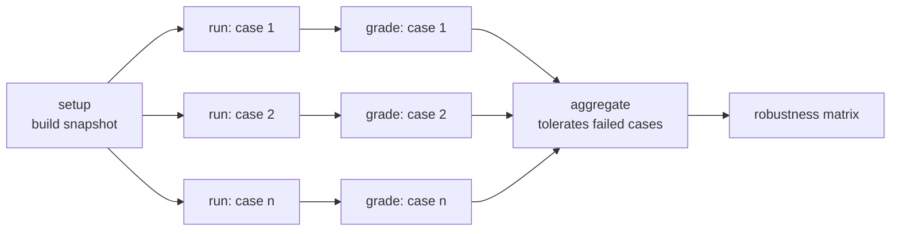

# groundtruth

**A robustness bench for web agents, built on an environment you own — so "did the agent succeed?" is a SQL query, not a guess.**

Runs on [Solari](#solari-integration): the shop runs in a Solari sandbox, the agent drives a Solari browser.

---

## Why this exists

Most web-agent evals run against the live web. That has three problems nobody fixes:

1. **No ground truth.** You can't query Amazon's database to see if the order really went through. So harnesses screenshot the final page and ask an LLM "did it work?" — which accepts an agent that *says* it succeeded while doing nothing.
2. **The world drifts.** Prices change, carts expire, layouts get redesigned. A failure today might be the site, not the agent.
3. **You can't experiment.** You can't move Amazon's checkout button to see if the agent still finds it.

groundtruth fixes all three by owning the website. The shop is ~300 lines of FastAPI + SQLite that we wrote, so we can:

- **grade by reading the database** — the truth, not a picture of it
- **reset to an identical world** for every single case
- **change the site on purpose** and measure what breaks the agent

## What it will measure

| Output | Question it answers |
|---|---|
| **Robustness matrix** | Pass rate per task × per site change. "92% clean, 41% once a modal appears." |
| **Grader agreement** | How often does a screenshot judge disagree with the database? How many false successes does it accept? |
| **Side-effect safety** | When things go wrong, does the agent make it worse — double-order, cancel the wrong thing? |
| **Memory under change** | Does a knowledge-graph memory make the agent better on a familiar site — and worse once the site changes? |

v0 (this commit) builds the foundation all three stand on.

---

## The workflow

### One case, start to finish

Every run of every task follows the same path. The seed is built once; everything after the copy is private to that case.



The **baseline** is what makes side-effect checks possible. Anything with an order id above it was created by the agent — so "exactly one new order" is a real question with a real answer.

### Calibrating the instrument

Before any agent result means anything, the grader has to prove it can tell success from failure. Every task ships with an **oracle** — a scripted perfect run — and gets tested against a **noop** agent that does nothing.



`python -m bench.selfcheck` runs this. It exits non-zero if either branch fails. Run it after changing any task or the app.

### One case on Solari (v1)

v0 runs everything locally. In v1 the shop runs in a Solari sandbox forked from a snapshot, and the agent drives a Solari cloud browser. The grader doesn't change at all — it still reads a SQLite file, just one pulled back from the VM.



### The run as a graph (v1)

The engine expands the matrix — tasks × conditions × trials — into nodes at build time. Setup runs once; every case fans out; the aggregate waits for all of them and tolerates failures.



--- DB[("case.db")]
    end
    AG -->|HTTP| MUT
    GR["grader"] -->|reads| DB
    GR --> REPORT["robustness matrix"]
```

---

## Key concepts

These map one-to-one to the types in `bench/model.py`.

| Concept | What it is |
|---|---|
| **Task** | A goal in plain English, a start state, a list of checks, and an oracle. Self-contained: adding a task touches one place. |
| **Check** | One named yes/no question about the database — `correct_items`, `no_new_orders`. A task passes only if **all** its checks pass. Named checks mean failures are explainable, not just counted. |
| **Baseline** | A snapshot taken after setup, before the agent. Separates what the agent did from what was already there. |
| **Oracle** | A scripted correct run using the same forms a browser would. Proves the task is achievable. |
| **Case** | One task on one fresh database. The unit of isolation. |
| **Grade** | The result of every check for one case. |

---

## The v0 tasks

Each task tests a different kind of competence, and each has a trap — the plausible wrong move a weak agent makes.

| Task | Agent must | Checks | The trap |
|---|---|---|---|
| `buy_blue_shirt` | Buy one Blue Oxford Shirt to a given address | `exactly_one_new_order`, `correct_items`, `correct_address` | A White Oxford Shirt exists at the same price |
| `buy_socks_x3` | Buy 3 Wool Socks in one order | same three | Placing three separate orders of one |
| `buy_tote_and_mug` | Buy a tote and a mug, *nothing else* | same three | The cart already holds a Black Cap it must notice and remove |
| `cancel_latest_order` | Cancel the most recent order only | `latest_cancelled`, `older_order_untouched`, `no_new_orders` | Two orders exist; the older one is listed too |
| `empty_cart` | Empty the cart without buying | `cart_empty`, `no_new_orders` | Checking out *also* empties the cart |

That last one is the whole argument for multiple named checks: an agent that buys everything ends with an empty cart. `cart_empty` alone would pass it. `no_new_orders` catches it.

### Side effects count even if hidden

`new_orders` counts orders in **any** status. An agent that double-orders and then cancels one to cover it still created two orders — `exactly_one_new_order` fails. There's a test for exactly this.

---

## Quickstart

Requires Python 3.11+.

```bash
python -m venv .venv
source .venv/bin/activate          # Windows: .venv\Scripts\activate
pip install -e ".[dev]"

pytest                             # 25 tests: the app, calibration, adversarial agents
python -m bench.selfcheck          # oracle vs noop on every task
```

Expected selfcheck output:

```
task                   oracle   noop
------------------------------------------------------------
buy_blue_shirt         PASS     fail (exactly_one_new_order, correct_items, correct_address)
buy_socks_x3           PASS     fail (exactly_one_new_order, correct_items, correct_address)
buy_tote_and_mug       PASS     fail (exactly_one_new_order, correct_items, correct_address)
cancel_latest_order    PASS     fail (latest_cancelled)
empty_cart             PASS     fail (cart_empty)
------------------------------------------------------------
calibrated: grader separates success from failure
```

### Use the shop yourself

```bash
uvicorn app.main:default_app --factory --reload
```

Open http://127.0.0.1:8000 and log in as `alice@example.com` / `password123` (or `bob@example.com` / `hunter22`). The database lives at `data/app.db`; delete it to reset. Override with `GT_DB_PATH`.

Clicking through it yourself is the best way to see exactly what an agent sees.

---

## Repo layout

```
groundtruth/
├── app/                      the shop — the environment under test
│   ├── main.py               routes: login, browse, cart, checkout, orders, cancel
│   ├── db.py                 connection, password hashing, seed data
│   ├── schema.sql            5 tables: users, products, cart_items, orders, order_items
│   └── templates/            plain HTML, real forms, no JavaScript
├── bench/                    the instrument
│   ├── model.py              Task, Check, Baseline, Case, Grade
│   ├── env.py                seed once, copy per case, capture baseline
│   ├── tasks.py              the 5 tasks: setup, checks, oracle
│   ├── grader.py             runs every check against a case's database
│   └── selfcheck.py          calibration CLI
├── tests/
│   ├── test_app.py           the shop behaves correctly
│   └── test_ground_truth.py  the grader tells the truth
├── .env.example              SOLARI_API_KEY goes here (v1)
└── pyproject.toml            deps; `.[dev]` for tests, `.[solari]` for v1
```

---

## Adding a task

1. In `bench/tasks.py`, write a `setup(conn)` that builds the start state (or reuse `_no_setup`).
2. Write the checks. Every task needs at least one check that **doing nothing fails** and one **side-effect check** (`no_new_orders` or `exactly_one_new_order`).
3. Write the oracle — the correct run, through the same endpoints a browser uses.
4. Add it to `TASKS`.
5. Run `python -m bench.selfcheck`. If it doesn't say `calibrated`, the task isn't done.
6. Add one adversarial test to `tests/test_ground_truth.py`: the most plausible wrong agent, and the exact check it should fail.

Step 6 is the one people skip and the one that matters most. If you can't name the check a wrong agent fails, you don't yet know what your task measures.

---

## Roadmap

Each stage ends runnable. Nothing is built before the thing it depends on works.

### v0 — ground truth works ✓ (this commit)

Shop, seed, 5 tasks, SQL grader, calibration, adversarial tests. No real agent yet — the oracle and noop stand in.

**Learned:** why owning the environment beats scraping the live web; baseline snapshots; why a grader needs its own tests.

### v1 — the engine, a real agent, Solari, perturbations

Build in this order; each step runs before the next starts.

**1. The engine** (`bench/engine.py`) — the async DAG scheduler: ready queue, global + per-group semaphores, retries with backoff, per-attempt timeouts, fault isolation, and a `tolerate_dep_failure` flag for the aggregate node. Write it from scratch; that's the warmup. Test it with fake sleep-nodes before anything real touches it.

**2. The graph builder** (`bench/run.py`) — expands tasks × conditions × trials into nodes:

```python
for task in TASKS:
    for cond in CONDITIONS:                 # "clean", "modal", "decoy_button", ...
        for trial in range(TRIALS):
            cid = f"{task.id}.{cond}.t{trial}"
            nodes.append(Node(f"run:{cid}", run_case(task, cond), deps=("setup",),
                              group="solari", retries=1))
            nodes.append(Node(f"grade:{cid}", grade_case, deps=(f"run:{cid}",)))
nodes.append(Node("aggregate", build_matrix, deps=all_grades, tolerate_dep_failure=True))
```

Three rules make it correct:

- **Retry infrastructure errors, never agent mistakes.** A browser that failed to launch gets retried. An agent that finished and bought the wrong shirt is data — retrying it hides the flakiness you're trying to measure. So `run_case` raises only on infra failures and *returns* normally when the agent finishes, right or wrong.
- **Every retry starts from a fresh database.** `run_case` calls `prepare_case` itself, so attempt 2 never inherits attempt 1's half-placed order.
- **Grade nodes are pure.** They only read a local file, so retrying them is free. No network calls inside them — that's why replays are a post-pass.

**3. The agent interface** (`bench/agent.py`) — one method: `run(instruction, browser) -> Transcript`. `browser` is the Playwright-compatible object from `solari.launch()`, so any Playwright-based agent plugs in.

**4. Solari wiring** (`bench/solari_runner.py`) — the flow in [Solari integration](#solari-integration).

**5. Trials and honest metrics** — run every case 3–5 times and report:

| Metric | Why |
|---|---|
| Pass rate per cell | The basic number. |
| **pass^k** — all k trials pass | Reliability. 80% per trial is only 51% at pass^3. |
| passed / attempted **and** passed / planned | If setup fails and 40 cases never run, "95% of attempted" hides that. Report both. |
| skipped, separately | Never folded into either denominator. |

**6. The mutation layer** (`app/mutations.py`) — middleware between browser and shop, selected per case by an env var. Six UI mutations to start: rename the button, hide it below the fold, cookie banner, modal in the checkout path, decoy button, added latency.

**First real result:** 5 tasks × 7 conditions (clean + 6) × 3 trials = 105 cases.

**Learning:** concurrency and scheduling, driving a cloud browser, VM lifecycle, middleware design, eval statistics.

### v2 — measure the measurement

Add two more graders next to SQL: a DOM check on the final page and an LLM screenshot judge. SQL is truth; report how often each disagrees with it. The screenshot judge's false-success rate is the headline number.

**Learning:** evaluation methodology, precision/recall of a grader, LLM-as-judge failure modes.

### v3 — faults and recovery

Mutations aimed at infrastructure instead of UI: 500 on the checkout POST, session expired mid-flow, dropped request. Measure recovery rate — and whether recovery attempts cause double orders.

**Learning:** failure injection, idempotency, why side-effect checks exist.

### v4 — the report

Static HTML: the matrix, worst cells first, and for every failure the step-by-step trace plus the rrweb replay of what the agent saw and did.

### v5 — knowledge-graph memory

Give the agent a memory it builds across runs: a graph of the site — pages, elements, actions, and outcomes ("*Place order* on `/checkout` creates an order"). The agent consults it before acting and updates it after.

Then run the experiment only this bench can run cleanly:

1. **Baseline** — the v1 agent, no memory, on the clean site.
2. **Memory, clean site** — same agent with the graph, warmed up on earlier runs. Expect faster and more reliable.
3. **Memory, mutated site** — the graph is now stale: it says the button is somewhere it no longer is. Does memory make the agent *more* brittle under change?

On the live web you can't answer question 3, because you don't control when the world changes. Here you do. A result like "memory +12 points on the clean site, −20 after a layout change" is a real finding.

This comes last on purpose: it's meaningless without the v1 no-memory baseline to compare against.

**Learning:** agent memory design, graph data modeling, staleness and invalidation, controlled experiments.

## Design decisions

- **Own the app instead of testing real sites.** Gives up realism; gets truth, reproducibility, and control. For measuring *robustness*, control wins — you can't isolate one variable on a site that changes weekly.
- **No JavaScript in the shop.** The page the agent sees is exactly what the server sent. Every action is a form POST that lands in SQLite. Nothing happens that the grader can't see. JS-heavy mutations come later, on purpose, as a perturbation.
- **One SQLite file per case, copied from a seed.** Isolation for the price of a file copy. No shared state, no cleanup, no ordering bugs when cases run in parallel.
- **Checks are named and granular.** "Failed" is useless. "Failed `correct_items`: got {'SHIRT-WHT': 1}" is a finding.
- **Checks only judge what the agent controls.** Order totals are the app's job, so no check tests them.
- **Every task has an oracle.** An unachievable task and a weak agent look identical in the results. The oracle rules out the first.
- **Money in integer cents.** No float rounding, ever.
- **Credentials in the instruction.** The agent logs in itself, like a real user. Pre-authenticated sessions can come later as an optimization.

## Solari integration

[Solari](https://getsolari.com) rents cloud browsers, sandboxes (microVMs that boot from a snapshot in about a second), and desktops behind one API key. groundtruth uses two of them. Docs: [docs.getsolari.com](https://docs.getsolari.com). Examples: [solari-cookbook](https://github.com/solari-sdk/solari-cookbook).

```bash
pip install -e ".[solari]"      # solari-browser + solari-sandbox
cp .env.example .env            # then add your SOLARI_API_KEY (from console.getsolari.com)
```

### The calls v1 uses

Checked against `solari-browser` 0.1.x and `solari-sandbox` 0.2.x.

**Once per run — build the shop snapshot:**

```python
from solari_sandbox import SandboxClient

client = SandboxClient(api_key=KEY, base_url="https://api.getsolari.com")  # base_url is required
base = await client.create(template="base", timeout_ms=600_000)
await base.connect()
# upload the repo with base.files.write(...), then:
await base.commands.run("python3", args=["-m", "pip", "install", "-e", "."], cwd="/app")
snap_id = await base.snapshot("groundtruth-shop")
await base.kill()
```

**Per case:**

```python
case = prepare_case(task, workdir, seed)                       # local, unchanged from v0
sbx = await client.create(from_snapshot=snap_id, timeout_ms=300_000)
try:
    await sbx.connect()
    await sbx.files.write("/app/data/app.db", case.db_path.read_bytes())
    await sbx.commands.run(
        "python3",
        args=["-m", "uvicorn", "app.main:default_app", "--factory",
              "--host", "0.0.0.0", "--port", "8000"],
        cwd="/app", background=True,
    )
    url = (await sbx.preview_url(8000))["url"]                 # public *.preview.getsolari.com

    browser = await solari.launch(recording=True)              # Playwright-compatible
    try:
        transcript = await agent.run(task.instruction(url), browser)
    finally:
        await browser.close()                                  # releases the session

    case.db_path.write_bytes(await sbx.files.read("/app/data/app.db"))
finally:
    await sbx.kill()
# then: grade(case) — the v0 grader, untouched
```

**After the run — replays (post-pass, not in the graph):**

```python
blob = await solari.sessions.download_replay(session_id)       # rrweb NDJSON, already decompressed
```

### Gotchas that shape the design

- **`kill()` ends a VM; `close()` doesn't.** `close()` only drops your control channel — the VM keeps running until its idle timeout. `kill()` goes in `finally`.
- **`browser.close()` releases the browser session.** Skip it and the slot stays held. Always in `finally`.
- **`timeout_ms` is a rolling idle window**, reset on every use — not a hard deadline. The engine's per-node timeout is the real limit.
- **Commands are not shell-interpreted.** Program in `cmd`, argv in `args`. `run("ls -la")` looks for a binary literally named `ls -la`.
- **Recording is opt-in per session** (`recording=True` at launch). Replays upload *after* release, so the first download usually 404s — poll for ~30s.
- **Concurrency is plan-limited.** Your plan's concurrent VM/session limit becomes the engine's `group="solari"` cap.
- **Preview URLs are public.** Fine for a throwaway VM with fake data — but set `GT_SECRET_KEY` per run rather than using the dev default.

### Worth testing early

`Sandbox.revert(snapshot_id)` exists in the SDK but isn't documented. If it resets a running VM in place, each worker could reuse one VM and revert between cases instead of creating a fresh one — much faster. Verify the semantics before designing around it.

### Why Solari fits this project

The cookbook's `browser-page-assertions-py` example makes the same point this project is built on: a recorded, screenshotted run can still land on the wrong page, so a recording proves the run *happened*, not that it *succeeded*. groundtruth takes that to its conclusion — the recording is for debugging; the database is for grading.
